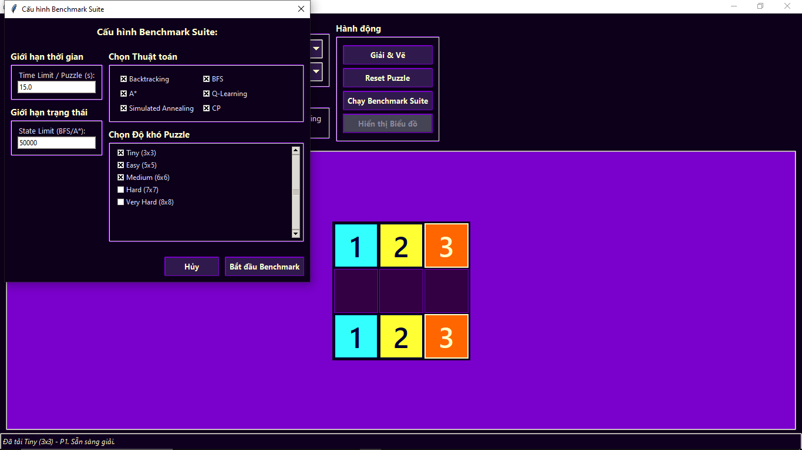

# Flow Free Solver & Benchmarker - Galaxy Edition


*Giao diện chính của ứng dụng Flow Free Solver*

---

## Giới thiệu

Flow Free là một trò chơi giải đố logic, nơi bạn cần nối các cặp điểm màu giống nhau trên lưới sao cho các đường đi không cắt nhau và lấp đầy toàn bộ lưới. Dự án này cung cấp:
- Công cụ giải tự động nhiều loại puzzle Flow Free với nhiều thuật toán khác nhau.
- Giao diện trực quan, dễ sử dụng, chủ đề "Galaxy".
- Chức năng benchmark, so sánh hiệu suất các thuật toán, hiển thị biểu đồ trực quan.

---

## Thành viên thực hiện

| Họ tên              | MSSV      | Vai trò chính                                                                 |
|---------------------|-----------|-------------------------------------------------------------------------------|
| Đỗ Kiến Hưng        | 23133030  | Xây dựng bộ đề bài, thực hiện chức năng chương trình, kiểm thử chương trình. |
| Phan Trọng Quí      | 23133061  | Xây dựng thuật toán, xây dựng báo cáo, thiết kế giao diện, kiểm thử thuật toán. |
| Phan Trọng Phú      | 23133056  | Xây dựng thuật toán, xây dựng báo cáo, thiết kế giao diện, quản lý GitHub.   |

---

## Tính năng nổi bật

- **Giao diện đồ họa (Tkinter):**  
  
  *Chọn thuật toán và heuristic trực tiếp trên giao diện*

- **Nhiều thuật toán giải:**
    - Backtracking (Quay lui tối ưu)
    - Breadth-First Search (BFS)
    - A* Search (A sao) với nhiều heuristic
    - Constraint Programming (CP) với Google OR-Tools (nếu có)
    - Simulated Annealing, Q-Learning (nếu có)

- **Benchmark & Biểu đồ:**  
  
  *Kết quả benchmark các thuật toán trên nhiều puzzle*

  
  *Biểu đồ so sánh thời gian giải của các thuật toán*

- **Tối ưu heuristic cho A\*:**  
  
  *So sánh hiệu quả các heuristic trên cùng một puzzle*

- **Chạy từ dòng lệnh:**  
  Hỗ trợ benchmark tự động, xuất file CSV, cấu hình thuật toán, puzzle, giới hạn thời gian...

---

## Yêu cầu hệ thống

- Python 3.7+
- Tkinter (mặc định có sẵn với Python)
- **Tùy chọn:**  
    - `matplotlib` (vẽ biểu đồ)
    - `ortools` (thuật toán CP)

---

## Hướng dẫn sử dụng

### Chạy giao diện GUI

```bash
python main.py
```

### Chạy benchmark từ dòng lệnh

```bash
python main.py --run_benchmark --algorithms="A*,BFS" --puzzles="Easy (5x5)"
```

### Sử dụng GUI

1. Chọn độ khó và puzzle từ menu.
2. Chọn thuật toán và heuristic (nếu dùng A*).
3. Nhấn **Giải & Vẽ** để giải puzzle.
4. Nhấn **Reset Puzzle** để làm mới.
5. Chạy benchmark bằng nút tương ứng.
6. Xem biểu đồ nếu đã chạy benchmark và có matplotlib.

---

## Các thuật toán được triển khai

- **Backtracking (Quay lui):** DFS tối ưu, ưu tiên theo khoảng cách Manhattan.
- **BFS:** Tìm kiếm theo chiều rộng.
- **A\* Search:** Dùng heuristic để dẫn đường tìm kiếm.
- **Constraint Programming:** Dùng Google OR-Tools, mô hình hóa bằng ràng buộc.
- **Simulated Annealing, Q-Learning:** (nếu có)

---

## Heuristics cho A\*

- Manhattan Sum
- Manhattan Max
- Manhattan Avg + Incomplete Penalty

---

## Định dạng Puzzle đầu vào

Puzzle là chuỗi ký tự:
- `.` đại diện ô trống
- `1-9` và `A-Z` là các điểm đầu/cuối của các màu
- Mỗi màu phải có đúng hai điểm

**Ví dụ:**
```
1.2
...
1.2
```
Hoặc:
```
1.2.5
..3.4
.....
.2.5.
.134.
```

---

## Cấu trúc mã nguồn (Tổng quan)

- Import thư viện
- Hàm tiện ích: `get_neighbors`, `parse_puzzle_extended`, ...
- Heuristic: `h_manhattan_sum`, `h_manhattan_max`, ...
- Thuật toán: `solve_backtracking`, `solve_cp`, `solve_bfs`, `solve_astar`
- Dữ liệu puzzle mẫu: `PUZZLES`
- GUI: `FlowFreeApp` với các phương thức khởi tạo, sự kiện, hiển thị, giải puzzle

---

## Liên kết GitHub

[https://github.com/phantrongphu123/project_AI](https://github.com/phantrongphu123/project_AI)

---

## Một số hình ảnh minh họa

| Giao diện chính | Chọn thuật toán | Bảng benchmark | Biểu đồ benchmark | So sánh heuristic |
|-----------------|----------------|----------------|-------------------|-------------------|
|  |  |  |  |  |

---