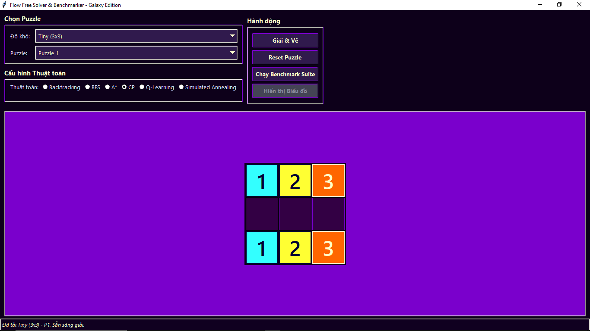
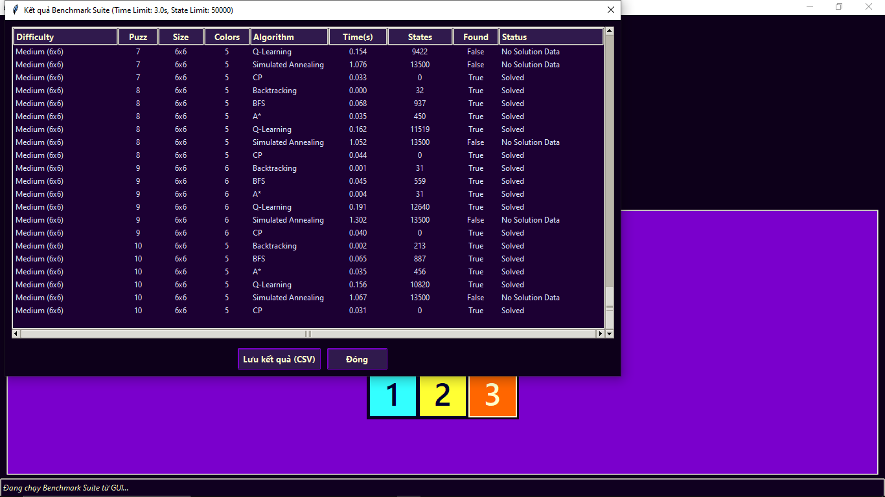
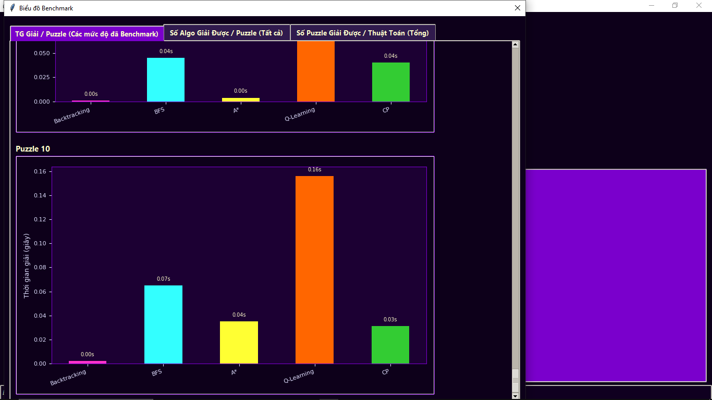
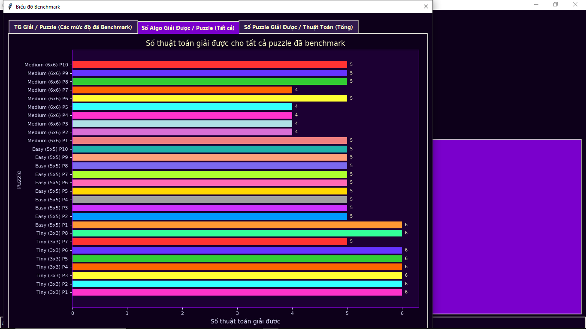
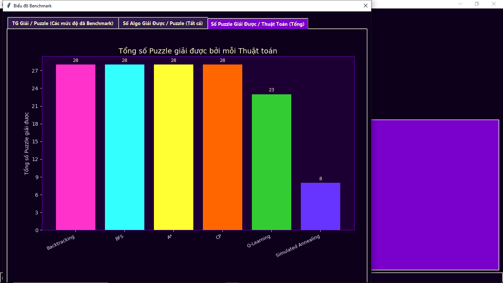
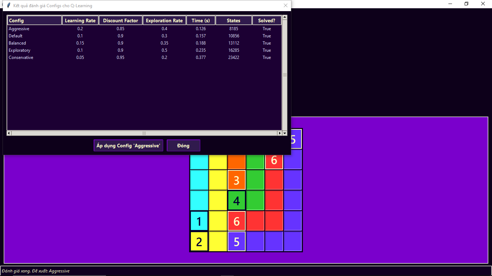
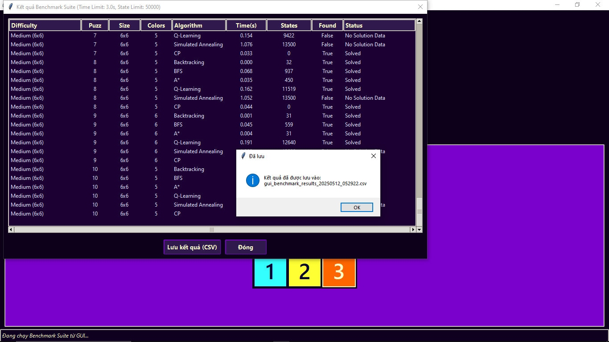
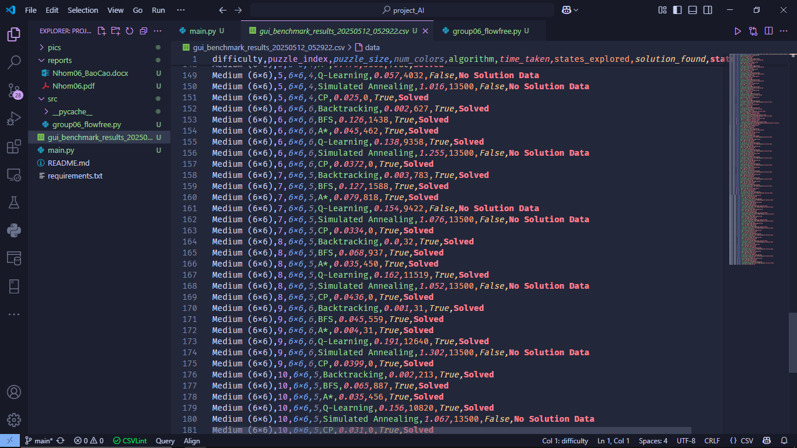

# Đồ án: Xây dựng Game Flow Free và Ứng dụng các Thuật toán Tìm kiếm AI

## Giới thiệu

Flow Free là trò chơi giải đố logic, mục tiêu là nối các cặp điểm màu trên lưới sao cho các đường đi không cắt nhau và lấp đầy toàn bộ lưới. Dự án này cung cấp:
- Công cụ giải tự động nhiều loại puzzle Flow Free với nhiều thuật toán khác nhau.
- Giao diện trực quan, chủ đề "Galaxy".
- Chức năng benchmark, so sánh hiệu suất các thuật toán, hiển thị biểu đồ trực quan.

---

## Thành viên thực hiện

| Họ tên              | MSSV      | Vai trò chính                                                                 |
|---------------------|-----------|-------------------------------------------------------------------------------|
| Đỗ Kiến Hưng        | 23133030  | Xây dựng bộ đề bài, thực hiện chức năng chương trình, kiểm thử chương trình. |
| Phan Trọng Quí      | 23133061  | Xây dựng thuật toán, xây dựng báo cáo, thiết kế giao diện, kiểm thử thuật toán. |
| Phan Trọng Phú      | 23133056  | Xây dựng thuật toán, xây dựng báo cáo, thiết kế giao diện, quản lý GitHub.   |

---
## Cấu trúc thư mục 
```plaintext
project_AI_extracted/
├── project_AI/
│   ├── gui_benchmark_results_20250512_052922.csv
│   ├── main.py
│   ├── README.md
│   ├── reports/
│   │   └── Nhom06_BaoCao/
│   │       └── Nhom06_BaoCao
│   │       └── Nhom06_BaoCao.ppt
│   ├── src/
│   │   └── group06_flowfree.py
│   ├── requirements.txt
│   ├── .git/
│   └── pics/
│       ├── benchmark66.png
│       ├── benchmark_table.png
│       ├── graph01.png
│       ├── graph02.png
│       ├── graph03.png
│       ├── heuristicA.png
│       ├── heuristicQlearning.png
│       ├── main.png
│       ├── saveBenchmark.png
│       ├── saveBenchmarkCSV.png
│       ├── solve_with_Astar.png
│       ├── solve_with_backtracking.png
│       ├── solve_with_bfs.png
│       ├── solve_with_cp.png
│       ├── solve_with_qlearning.png
│       └── solve_with_qlearning_2.png
```


## Tính năng nổi bật

- **Giao diện đồ họa (Tkinter)**
- Nhiều thuật toán giải: Backtracking, BFS, A*, Constraint Programming (CP), Simulated Annealing, Q-Learning, AND-OR Search.
- Benchmark & biểu đồ so sánh hiệu suất.
- Tối ưu heuristic cho A*.
- Tối ưu config cho Q-Learning.
- Chạy từ dòng lệnh, xuất file CSV.

---

## Yêu cầu hệ thống

- Python 3.7+
- Tkinter (có sẵn với Python)
- **Tùy chọn:**  
    - `matplotlib` (vẽ biểu đồ)
    - `ortools` (thuật toán CP)
---

## Hướng dẫn sử dụng

### Chạy giao diện GUI
Giao diện người dùng của ứng dụng được thiết kế trực quan với các thành phần chính: khu vực chọn puzzle theo độ khó và chỉ số; khu vực cấu hình thuật toán cho phép chọn thuật toán, heuristic (cho A*), hoặc cấu hình (cho Q-Learning); khu vực hiển thị lưới game trung tâm; khu vực hành động với các nút "Giải & Vẽ", "Reset Puzzle", "Chạy Benchmark Suite", và "Hiển thị Biểu đồ"; cuối cùng là thanh trạng thái cung cấp thông tin cập nhật.

```bash
python main.py
```


### Sử dụng GUI

1. Chọn độ khó và puzzle từ menu.
2. Chọn thuật toán và heuristic (nếu dùng A*).
3. Nhấn **Giải & Vẽ** để giải puzzle.
4. Nhấn **Reset Puzzle** để làm mới.
5. Chạy benchmark bằng nút tương ứng.
6. Xem biểu đồ nếu đã chạy benchmark.

---

## Các thuật toán được triển khai

- **Backtracking (Nhóm CSPs):** DFS tối ưu, ưu tiên theo khoảng cách Manhattan.
- **BFS (Uninformed Search):** Tìm kiếm theo chiều rộng.
- **A\* Search (Informed Search):** Dùng heuristic để dẫn đường tìm kiếm.
- **Constraint Programming (Nhóm CSPs):** Dùng Google OR-Tools, mô hình hóa bằng ràng buộc.
- **Simulated Annealing (Local Search):** 	Tối ưu hóa gần đúng, cho phép nhảy khỏi cực tiểu cục bộ.
- **AND-OR Search (Complex Environments):** 	Sử dụng trong môi trường không xác định hoặc mục tiêu tổ hợp.
- **Q-Learning (Reinforcement Learning):** 		Agent học cách tối ưu hành động thông qua phần thưởng môi trường, không cần mô hình môi trường.

---

## Heuristics cho A\*

- Manhattan Sum
- Manhattan Max
- Manhattan Avg + Incomplete Penalty

## Config cho Q-Learning

---

## Định dạng Puzzle đầu vào

Puzzle là chuỗi ký tự:
- `.` đại diện ô trống
- `1-9` và `A-Z` là các điểm đầu/cuối của các màu
- Mỗi màu phải có đúng hai điểm

**Ví dụ:**
```
1.2
...
1.2
```
Hoặc:
```
1.2.5
..3.4
.....
.2.5.
.134.
```

---

## Cấu trúc mã nguồn (Tổng quan)

- Import thư viện
- Hàm tiện ích: `get_neighbors`, `parse_puzzle_extended`, ...
- Heuristic: `h_manhattan_sum`, `h_manhattan_max`, ...
- Thuật toán: `solve_backtracking`, `solve_cp`, `solve_bfs`, `solve_astar`, ...
- Dữ liệu puzzle mẫu: `PUZZLES`
- GUI: `FlowFreeApp` với các phương thức khởi tạo, sự kiện, hiển thị, giải puzzle

---

## Liên kết GitHub

[https://github.com/phantrongphu123/project_AI](https://github.com/phantrongphu123/project_AI)

---

## Một số hình ảnh minh họa

### Giao diện chính


### Bảng benchmark
Một trong những điểm mạnh của dự án là bộ công cụ benchmarking. Người dùng có thể cấu hình để chạy nhiều thuật toán trên các tập puzzle khác nhau, với các giới hạn về thời gian và số trạng thái. Kết quả chi tiết về thời gian, trạng thái duyệt, và tình trạng giải được ghi nhận và có thể lưu ra file CSV. Nếu Matplotlib được cài đặt, kết quả này có thể được trực quan hóa qua các biểu đồ so sánh hiệu năng, ví dụ như thời gian giải của các thuật toán trên từng puzzle, số thuật toán giải được mỗi puzzle, hay tổng số puzzle mỗi thuật toán giải được. Điều này cung cấp cái nhìn sâu sắc về điểm mạnh và yếu của từng phương pháp.


### Một số thuật toán khác

Dự án đã triển khai và tích hợp một loạt các thuật toán AI để giải quyết bài toán Flow Free, mỗi thuật toán có cách tiếp cận và đặc điểm riêng:

**Backtracking:** Thuật toán này hoạt động dựa trên nguyên lý thử-sai có hệ thống. Nó xây dựng giải pháp từng bước cho mỗi màu, ưu tiên mở rộng một màu cho đến khi hoàn thành hoặc gặp ngõ cụt. Nếu không thể đi tiếp hoặc các bước sau không dẫn đến lời giải, nó sẽ "quay lui" lại lựa chọn trước đó và thử một hướng đi khác. Mặc dù đơn giản và không tốn nhiều bộ nhớ, hiệu suất của Backtracking phụ thuộc nhiều vào thứ tự duyệt và có thể chậm với các puzzle phức tạp.


**Breadth-First Search (BFS):** BFS khám phá không gian trạng thái theo từng lớp, đảm bảo tìm ra lời giải nông nhất nếu tồn tại. Nó sử dụng một hàng đợi để quản lý các trạng thái (bao gồm lưới, thông tin các đường đi, và màu đang được mở rộng) và một tập `visited` để tránh chu trình. BFS hoàn chỉnh nhưng đòi hỏi không gian bộ nhớ lớn.


**A** Search:** Đây là một thuật toán tìm kiếm có thông tin, sử dụng hàm đánh giá `f(n) = g(n) + h(n)` để hướng dẫn quá trình tìm kiếm. `g(n)` là chi phí thực tế (số ô đã vẽ) và `h(n)` là chi phí ước lượng đến đích. Dự án triển khai nhiều hàm heuristic như tổng khoảng cách Manhattan, khoảng cách Manhattan lớn nhất, và một biến thể kết hợp trung bình Manhattan với hình phạt cho các đường chưa hoàn thành. A* hiệu quả hơn BFS nếu có heuristic tốt và đảm bảo tối ưu nếu heuristic là "admissible".


**Constraint Programming (CP) với OR-Tools:** Cách tiếp cận này mô hình hóa Flow Free như một bài toán thỏa mãn ràng buộc (CSP). Các biến Boolean `is_path[r][c][k]` biểu thị ô `(r,c)` có thuộc đường đi của màu `k` hay không. Các ràng buộc bao gồm: mỗi ô chỉ thuộc một đường đi, các điểm đầu/cuối phải được gán đúng màu, và tính liên tục của đường đi (mỗi ô trên đường đi phải có đúng 2 hàng xóm cùng màu, trừ điểm đầu/cuối chỉ có 1). OR-Tools sau đó được sử dụng để tìm một phép gán thỏa mãn tất cả ràng buộc. Đây là một phương pháp mạnh mẽ, khai báo, nhưng đòi hỏi việc tái tạo đường đi từ kết quả lưới.


**Q-Learning:** Thuật toán học tăng cường này cho phép một tác nhân học chiến lược giải thông qua tương tác thử-sai với môi trường. Trạng thái được định nghĩa bởi lưới và màu đang hoạt động, hành động là việc chọn ô tiếp theo. Hàm Q `Q(s,a)` ước lượng chất lượng của hành động. Phần thưởng được thiết kế để khuyến khích hoàn thành các màu và lấp đầy lưới. Sau nhiều episodes học, Q-table được sử dụng để đưa ra quyết định tối ưu.


**Simulated Annealing:** Thuật toán tối ưu hóa này bắt đầu với một giải pháp ngẫu nhiên và cố gắng cải thiện dần bằng cách thực hiện các thay đổi nhỏ. Nó có khả năng chấp nhận các bước đi "tệ hơn" với một xác suất nhất định (giảm dần theo "nhiệt độ") để tránh bị kẹt ở các điểm tối ưu cục bộ. Hàm năng lượng đánh giá chất lượng giải pháp dựa trên số ô trống, khoảng cách chưa hoàn thành, v.v.


**AND-OR Search:** Thuật toán này được thiết kế cho các bài toán có thể phân rã. Trong Flow Free, mỗi trạng thái lưới có thể xem là một nút OR, nơi tác nhân chọn một màu và một hướng đi. Vì game là tất định, hành động đó dẫn đến một trạng thái mới duy nhất. Quá trình tìm kiếm tương tự DFS có cấu trúc, nhằm tìm một chuỗi hành động dẫn đến mục tiêu.


#### Benchmark tổng hợp


#### Biểu đồ phụ 1


#### Biểu đồ phụ 2


#### Biểu đồ phụ 3


#### Heuristic Q-Learning


#### Heuristic AStar


#### Lưu kết quả benchmark


#### Lưu benchmark CSV


---

