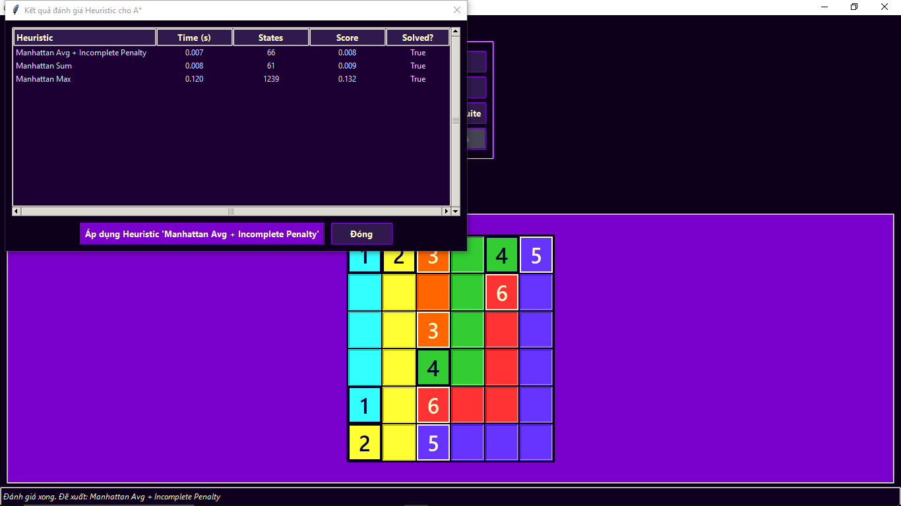

# Flow Free Solver & Benchmarker - Galaxy Edition

## Giới thiệu

Flow Free là trò chơi giải đố logic, mục tiêu là nối các cặp điểm màu trên lưới sao cho các đường đi không cắt nhau và lấp đầy toàn bộ lưới. Dự án này cung cấp:
- Công cụ giải tự động nhiều loại puzzle Flow Free với nhiều thuật toán khác nhau.
- Giao diện trực quan, chủ đề "Galaxy".
- Chức năng benchmark, so sánh hiệu suất các thuật toán, hiển thị biểu đồ trực quan.

---

## Thành viên thực hiện

| Họ tên              | MSSV      | Vai trò chính                                                                 |
|---------------------|-----------|-------------------------------------------------------------------------------|
| Đỗ Kiến Hưng        | 23133030  | Xây dựng bộ đề bài, thực hiện chức năng chương trình, kiểm thử chương trình. |
| Phan Trọng Quí      | 23133061  | Xây dựng thuật toán, xây dựng báo cáo, thiết kế giao diện, kiểm thử thuật toán. |
| Phan Trọng Phú      | 23133056  | Xây dựng thuật toán, xây dựng báo cáo, thiết kế giao diện, quản lý GitHub.   |

---

## Tính năng nổi bật

- **Giao diện đồ họa (Tkinter)**
- Nhiều thuật toán giải: Backtracking, BFS, A*, Constraint Programming (CP), Simulated Annealing, Q-Learning.
- Benchmark & biểu đồ so sánh hiệu suất.
- Tối ưu heuristic cho A*.
- Chạy từ dòng lệnh, xuất file CSV.

---

## Yêu cầu hệ thống

- Python 3.7+
- Tkinter (có sẵn với Python)
- **Tùy chọn:**  
    - `matplotlib` (vẽ biểu đồ)
    - `ortools` (thuật toán CP)
    - `pygame` (nếu dùng hiệu ứng)

---

## Hướng dẫn sử dụng

### Chạy giao diện GUI

```bash
python main.py
```

### Chạy benchmark từ dòng lệnh

```bash
python main.py --run_benchmark --algorithms="A*,BFS" --puzzles="Easy (5x5)"
```

### Sử dụng GUI

1. Chọn độ khó và puzzle từ menu.
2. Chọn thuật toán và heuristic (nếu dùng A*).
3. Nhấn **Giải & Vẽ** để giải puzzle.
4. Nhấn **Reset Puzzle** để làm mới.
5. Chạy benchmark bằng nút tương ứng.
6. Xem biểu đồ nếu đã chạy benchmark và có matplotlib.

---

## Các thuật toán được triển khai

- **Backtracking (Quay lui):** DFS tối ưu, ưu tiên theo khoảng cách Manhattan.
- **BFS:** Tìm kiếm theo chiều rộng.
- **A\* Search:** Dùng heuristic để dẫn đường tìm kiếm.
- **Constraint Programming:** Dùng Google OR-Tools, mô hình hóa bằng ràng buộc.
- **Simulated Annealing, Q-Learning:** (nếu có)

---

## Heuristics cho A\*

- Manhattan Sum
- Manhattan Max
- Manhattan Avg + Incomplete Penalty

---

## Định dạng Puzzle đầu vào

Puzzle là chuỗi ký tự:
- `.` đại diện ô trống
- `1-9` và `A-Z` là các điểm đầu/cuối của các màu
- Mỗi màu phải có đúng hai điểm

**Ví dụ:**
```
1.2
...
1.2
```
Hoặc:
```
1.2.5
..3.4
.....
.2.5.
.134.
```

---

## Cấu trúc mã nguồn (Tổng quan)

- Import thư viện
- Hàm tiện ích: `get_neighbors`, `parse_puzzle_extended`, ...
- Heuristic: `h_manhattan_sum`, `h_manhattan_max`, ...
- Thuật toán: `solve_backtracking`, `solve_cp`, `solve_bfs`, `solve_astar`
- Dữ liệu puzzle mẫu: `PUZZLES`
- GUI: `FlowFreeApp` với các phương thức khởi tạo, sự kiện, hiển thị, giải puzzle

---

## Liên kết GitHub

[https://github.com/phantrongphu123/project_AI](https://github.com/phantrongphu123/project_AI)

---

## Một số hình ảnh minh họa

### Giao diện chính


### Bảng benchmark


### Một số thuật toán khác
#### Giải bằng A*


#### Giải bằng Backtracking


#### Giải bằng BFS


#### Giải bằng CP


#### Giải bằng Q-Learning


#### Giải bằng Simulated Annealing


#### Benchmark tổng hợp


#### Biểu đồ phụ 1


#### Biểu đồ phụ 2


#### Biểu đồ phụ 3


#### Heuristic Q-Learning


#### Heuristic AStar


#### Lưu kết quả benchmark


#### Lưu benchmark CSV


---
